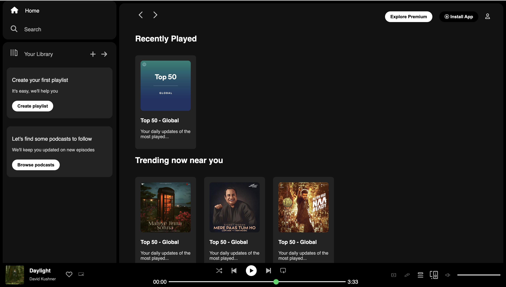

# Spotify Homepage Clone 

This is a frontend clone of Spotify’s homepage built using HTML and CSS.  
Currently in development — interactive features will be added using JavaScript.

##  Features Implemented
- Sidebar navigation
- Responsive grid layout for playlists
- Footer music player with icon layout
- Dark mode design

##  Tech Stack
- HTML5
- CSS3
- Planned: JavaScript (for interactivity)

##  Project Status
- Layout and styling complete  
- JavaScript enhancements coming soon  
- Preview below!

## Preview
 <!-- save your screenshot inside /photos -->

## 📁 Folder Structure
